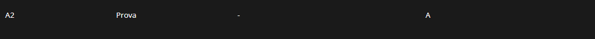

# 🐾 2026-prog2-trabalho-PainelAdocao

> **🏆 Avaliação:** Trabalho avaliado com nota **A** na disciplina de Programação 2!




## 1. Descrição do Projeto
Este projeto consiste num **Painel de Adoção de Animais**, desenvolvido como requisito avaliativo para a disciplina de Programação 2. A aplicação foi criada utilizando exclusivamente a biblioteca gráfica **Java Swing** e segue os padrões de Programação Orientada a Objetos (POO), organização em pacotes e separação de responsabilidades.

O sistema permite que uma ONG de proteção animal faça a gestão prática do cadastro de animais disponíveis, visualize perfis por meio de uma galeria interativa de fotos e registre os adotantes interessados, realizando o vínculo direto de adoção e atualizando os status em tempo real.

---

## 2. 🛠️ Tecnologias e Ferramentas Utilizadas
* **Linguagem:** Java (JDK 25)
* **Gerenciador de Dependências:** Apache Maven
* **Interface Gráfica:** Java Swing
* **Bibliotecas Externas:** * `FlatLaf`: Para modernização do design da interface (Look and Feel).
  * `Gson`: Para desserialização de dados JSON na API do ViaCEP.
* **IDE Padrão:** Apache NetBeans (O projeto contém as configurações nativas do NetBeans, como os arquivos `.form` e `nbactions.xml`).

---

## 3. Integrantes do Grupo
Desenvolvido por:
* [Erick Tiepo](https://github.com/ErickTiepo)
* [Victor Hugo de Souza Mendes](https://github.com/victorhugosilva371-netizen)

---

## 4. 📖 Guia de Uso (Passo a Passo)
Para testar o fluxo completo do sistema, siga os passos abaixo após compilar o projeto:

1. **Autenticação:** Na Tela de Login, acesse com o usuário **`admin`** e a senha **`admin`**.
2. **Cadastrar Animal:** Vá até a aba "Animais". Preencha os dados, selecione o porte/temperamento, carregue uma foto em `.png` ou `.jpg` e clique em Salvar. O animal aparecerá na tabela com o status "Disponível".
3. **Visualizar Galeria:** Mude para a aba "Galeria". O animal recém-cadastrado aparecerá como um "Card". Clique na foto dele para abrir a ficha completa de detalhes.
4. **Cadastrar Adotante:** Vá para a aba "Adotantes". Digite um CEP válido e clique em "Buscar CEP" (os dados de endereço preencherão sozinhos). Preencha o nome e CPF.
5. **Realizar Adoção:** Ainda no formulário do adotante, selecione o animal desejado no *ComboBox* de "Animal Adotado" e salve. O sistema automaticamente vai até a tabela de Animais e muda o status do bicho para "Adotado", vinculando-o ao novo dono.

---

## 5. 🏗️ Arquitetura e Organização do Código
O projeto foi estruturado seguindo o padrão **MVC (Model-View-Service)** para garantir fácil manutenção:

```text
📦 2026-prog2-trabalho-PainelAdocao
 ┣ 📂 src
 ┃ ┣ 📂 main
 ┃ ┃ ┣ 📂 java
 ┃ ┃ ┃ ┗ 📂 br/edu/bsi/prog2/paineladocao
 ┃ ┃ ┃   ┣ 📂 model
 ┃ ┃ ┃   ┃ ┣ 📜 Adotante.java
 ┃ ┃ ┃   ┃ ┗ 📜 Animal.java
 ┃ ┃ ┃   ┣ 📂 service
 ┃ ┃ ┃   ┃ ┗ 📜 ViaCepService.java
 ┃ ┃ ┃   ┣ 📂 view
 ┃ ┃ ┃   ┃ ┣ 📜 CardAnimal.java
 ┃ ┃ ┃   ┃ ┣ 📜 DialogFichaAnimal.java
 ┃ ┃ ┃   ┃ ┣ 📜 TelaLogin.java
 ┃ ┃ ┃   ┃ ┗ 📜 TelaPrincipal.java
 ┃ ┃ ┃   ┗ 📜 PainelAdocao.java (Main)
 ┃ ┃ ┗ 📂 resources
 ┃ ┃   ┣ 🖼️ image-galery.png
 ┃ ┃   ┣ 🖼️ kitten.png
 ┃ ┃   ┗ 🖼️ ... (outros ícones do sistema)
 ┣ 📜 pom.xml
 ┗ 📜 README.md
```

---

## 6. ⚙️ Funcionalidades Técnicas Detalhadas

* **POO Aplicada:** Uso estrito de encapsulamento nas classes `model`, com geração de IDs de forma automática (Auto-Incremento via variável estática).
* **ComboBox Encadeado Dinâmico:** Na aba Animais, a seleção da Espécie atualiza dinamicamente a lista de Raças correspondente no segundo `JComboBox`.
* **Upload e Tratamento de Imagens:** Uso do `JFileChooser` para carregar fotos locais, com leitura via `ImageIO` e redimensionamento dinâmico (`getScaledInstance`) para exibição em `JLabel`.
* **Componentes Swing Avançados:** Uso de `JTabbedPane` para navegação, `JRadioButton` agrupados e `JCheckBox` dinâmicos.
* **Gestão de Tabelas (JTable):** Operações CRUD baseadas no `DefaultTableModel`, com reflexo em tempo real entre a exclusão de um adotante e a reversão do status do animal para "Disponível".
* **Alertas e Validações:** Tratamento de segurança ao fechar o sistema (Arquivo -> Sair) e ao validar campos vazios, utilizando `JOptionPane`.

---

## 7. 🚀 Instruções para Compilar e Executar

### Pré-requisitos
* Java JDK 17, 21 ou 25 instalado.
* Apache Maven configurado.
* (Opcional) Apache NetBeans IDE para abrir o projeto nativamente.

### Opção 1: Via Terminal / Prompt de Comando
Execute os comandos abaixo sequencialmente para clonar, compilar e rodar a aplicação:
```bash
git clone https://github.com/ErickTiepo/2026-prog2-trabalho-PainelAdocao.git
cd 2026-prog2-trabalho-PainelAdocao
mvn clean package
java -jar target/PainelAdocao-1.0-SNAPSHOT.jar
```

### Opção 2: Via IDE (NetBeans)
1. Clone o repositório em sua máquina local.
2. Abra o Apache NetBeans e vá em **File -> Open Project**.
3. Selecione a pasta `2026-prog2-trabalho-PainelAdocao`.
4. O NetBeans reconhecerá automaticamente as dependências no `pom.xml`. Clique em **Run Project** (F6) para iniciar.
